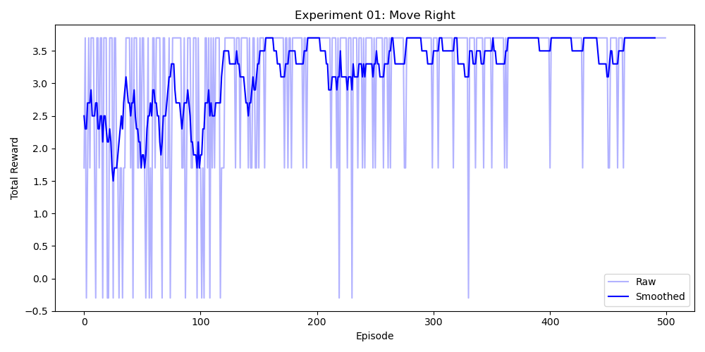

# Experiment 01: Move Right

## Setup
A gridworld with an agent placed at (2, 2) and reward points with value 2 placed at (2, 3) and (2, 4). Parameters:
- Step Penalty: -0.1
- Epsilon: 0.5, decays at 0.005 per episode.
- Gamma: 0.9
- Maximum Steps: 3
- Maximum Episodes: 500

## Hypothesis
After training, the agent will consistently acquire 3.7 reward per episode, and Q-table will show higher values
for 'right' actions in states where the agent hasn't collected both resources. In states where the agent has, expected reward 
will be similar for all actions.

## Results

- As hypothesized, agent consistently acquires 3.7 reward, Q-table shows higher value for 'right' actions when both resources haven't been
collected, and reward estimates that converge to the step penalty for all actions in states where both resources have been collected.
- Against the hypothesis, actions other than 'right' are consistently valued higher than expected. The value collapse for non-'right' actions
takes place only when only 2 actions remain.

## Discussion
- With 3 steps and 2 rewards, agent can take one 'non-right' action and still acquire reward entities at future steps. It is thus to be expected that 
actions other than 'right' show positive Q table values in the initial state. 
- The agent learns a locally optimal policy, rather than a globally optimal one. Experiment 02 will test whether this generalizes across starting positions.